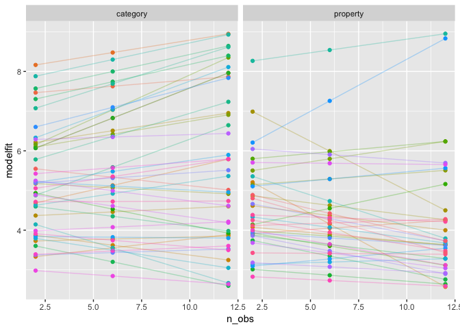
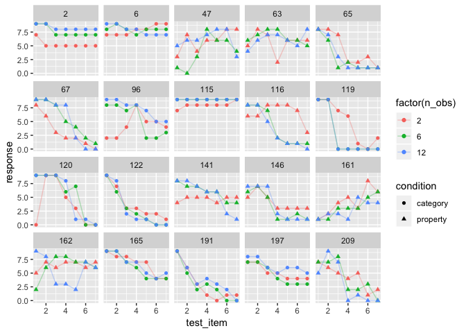
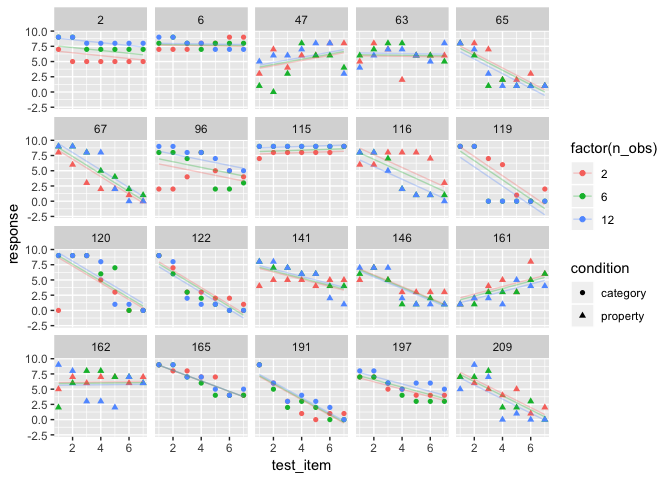
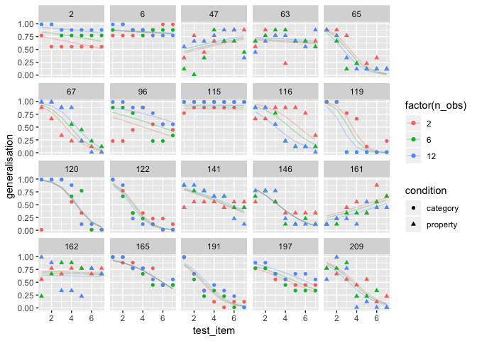

<h1 class="title toc-ignore display-3">
Mixed models in R
</h1>
================
Danielle Navarro
5 December 2018

<!--

  html_document:
    includes:
      in_header: header.html
    theme: flatly
    highlight: textmate
    css: mystyle.css

-->
``` r
library(here)
```

    ## here() starts at /Users/dan/GitHub/chdss2018/day2_dataanalysis

``` r
library(tidyverse)
```

    ## ── Attaching packages ─────────────────────────────────────────────────────────────────────── tidyverse 1.2.1 ──

    ## ✔ ggplot2 3.1.0     ✔ purrr   0.2.5
    ## ✔ tibble  1.4.2     ✔ dplyr   0.7.8
    ## ✔ tidyr   0.8.1     ✔ stringr 1.3.1
    ## ✔ readr   1.1.1     ✔ forcats 0.3.0

    ## ── Conflicts ────────────────────────────────────────────────────────────────────────── tidyverse_conflicts() ──
    ## ✖ dplyr::filter() masks stats::filter()
    ## ✖ dplyr::lag()    masks stats::lag()

``` r
library(lme4)
```

    ## Loading required package: Matrix

    ## 
    ## Attaching package: 'Matrix'

    ## The following object is masked from 'package:tidyr':
    ## 
    ##     expand

``` r
frames <- read_csv(here("analysis","data","frames_ex2.csv"))
```

    ## Parsed with column specification:
    ## cols(
    ##   id = col_integer(),
    ##   gender = col_character(),
    ##   age = col_integer(),
    ##   condition = col_character(),
    ##   sample_size = col_character(),
    ##   n_obs = col_integer(),
    ##   test_item = col_integer(),
    ##   response = col_integer()
    ## )

Example 1: A simple mixed model
-------------------------------

To get started with mixed models, we will look at a version of the `frames` data that is a little more complex than the `tinyframes` data from the last section, but not quite the full thing yet. Specifically, what we'll do is take the (within-subject) average responses across every `test_item`, but we *won't* average across the different values of `n_obs`. That gives us a `modestframes` data set:

``` r
modestframes <- frames %>% 
  group_by(id, age, condition, n_obs) %>%
  summarise(response = mean(response)) %>%
  ungroup()

glimpse(modestframes)
```

    ## Observations: 675
    ## Variables: 5
    ## $ id        <int> 1, 1, 1, 2, 2, 2, 3, 3, 3, 4, 4, 4, 5, 5, 5, 6, 6, 6...
    ## $ age       <int> 36, 36, 36, 46, 46, 46, 33, 33, 33, 71, 71, 71, 23, ...
    ## $ condition <chr> "category", "category", "category", "category", "cat...
    ## $ n_obs     <int> 2, 6, 12, 2, 6, 12, 2, 6, 12, 2, 6, 12, 2, 6, 12, 2,...
    ## $ response  <dbl> 5.857143, 5.285714, 4.857143, 5.285714, 7.571429, 8....

Let's start by building some possible models. The simplest model we might want to consider is one in which the population mean response is different from zero (i.e., a fixed effect for the intercept), but there is variation in the mean response across individuals (i.e., a random intercept for each participant). The model formula for this is written:

``` r
response ~ 1 + (1|id)
```

The first part of this model description `response ~ 1` is something we've seen before under linear models: it's the model that has an intercept but nothing else! Anything in parentheses `(1|id)` is a random effect term. In this case, we have a separate intercept for each person (i.e., each unique `id`). As an alternative, we might want to consider a model that includes fixed effects for the between-subject factor `condition` and the within-subject factor `n_obs`. The formula for that, expressed in `lme4` notation, is

``` r
response ~ 1 + condition + n_obs + (1|id)
```

In real life, we might want to also consider models that only contain one of these two fixed effects, but for simplicity I'm not going to bother with that here. Instead, let's jump straight to estimating these two models:

``` r
modest1 <- lmer(formula = response ~ 1 + (1|id), data = modestframes)
modest2 <- lmer(formula = response ~ condition + n_obs + (1|id), data = modestframes)
```

To compare them:

``` r
anova(modest1, modest2)
```

    ## refitting model(s) with ML (instead of REML)

    ## Data: modestframes
    ## Models:
    ## modest1: response ~ 1 + (1 | id)
    ## modest2: response ~ condition + n_obs + (1 | id)
    ##         Df    AIC    BIC  logLik deviance  Chisq Chi Df Pr(>Chisq)    
    ## modest1  3 2354.9 2368.5 -1174.5   2348.9                             
    ## modest2  5 2333.5 2356.1 -1161.8   2323.5 25.403      2  3.046e-06 ***
    ## ---
    ## Signif. codes:  0 '***' 0.001 '**' 0.01 '*' 0.05 '.' 0.1 ' ' 1

One thing that is nice about mixed models is that you can allow much more customisation than this. For instance, is it really all that plausible to think that everyone has a unique "random intercept" term, but is affected by the sample size in precisely the same way? That seems unlikely. To see this, let's plot the data for a random subset of 80 participants:

``` r
whichids <- sample(unique(modestframes$id), 80)
modestframes %>%
  filter(id %in% whichids) %>%
  ggplot(aes(x = n_obs, y = response, colour = factor(id))) +
  geom_point(show.legend = FALSE) + 
  geom_line(show.legend = FALSE, alpha = .3) + 
  facet_wrap(~ condition)
```


To my mind, it beggars belief to think that these lines are all supposed to have the same slope, so we should probably extend the model a bit. Let's suppose that everyone has their own "random slope" term (i.e., everyone has their own regression coefficient for the effect of sample size). That gives us this model:

``` r
modest3 <- lmer(formula = response ~ condition + n_obs + (1 + n_obs|id), data = modestframes)
```

Okay let's compare the expanded model to the model that only has a random intercept:

``` r
anova(modest2, modest3)
```

    ## refitting model(s) with ML (instead of REML)

    ## Data: modestframes
    ## Models:
    ## modest2: response ~ condition + n_obs + (1 | id)
    ## modest3: response ~ condition + n_obs + (1 + n_obs | id)
    ##         Df    AIC    BIC  logLik deviance  Chisq Chi Df Pr(>Chisq)    
    ## modest2  5 2333.5 2356.1 -1161.8   2323.5                             
    ## modest3  7 2270.4 2302.0 -1128.2   2256.4 67.164      2  2.603e-15 ***
    ## ---
    ## Signif. codes:  0 '***' 0.001 '**' 0.01 '*' 0.05 '.' 0.1 ' ' 1

Overall, it looks like this new model is providing a better account of the data, as evidenced by the lower AIC and BIC values. We can get a quantitative summary of how this model performs:

``` r
summary(modest3)
```

    ## Linear mixed model fit by REML ['lmerMod']
    ## Formula: response ~ condition + n_obs + (1 + n_obs | id)
    ##    Data: modestframes
    ## 
    ## REML criterion at convergence: 2267.9
    ## 
    ## Scaled residuals: 
    ##     Min      1Q  Median      3Q     Max 
    ## -2.8960 -0.3681 -0.0306  0.3557  3.3860 
    ## 
    ## Random effects:
    ##  Groups   Name        Variance Std.Dev. Corr 
    ##  id       (Intercept) 1.72618  1.3138        
    ##           n_obs       0.01684  0.1298   -0.21
    ##  Residual             0.55277  0.7435        
    ## Number of obs: 675, groups:  id, 225
    ## 
    ## Fixed effects:
    ##                     Estimate Std. Error t value
    ## (Intercept)        5.2256978  0.1385646  37.713
    ## conditionproperty -0.6693767  0.1874783  -3.570
    ## n_obs              0.0004094  0.0111058   0.037
    ## 
    ## Correlation of Fixed Effects:
    ##             (Intr) cndtnp
    ## cndtnprprty -0.667       
    ## n_obs       -0.311  0.000

Very nice. However, if we're thinking that we might be satisfied with this model, we should now start the process of "model criticism". Let's extract the fitted values ("predictions") and add them to the data frame:

``` r
modestframes$modelfit <- predict(modest3)
```

One very simple check is to draw a scatterplot showing the fitted (modelled) responses against the raw data. How closely do they resemble one another?

``` r
modestframes %>% 
  ggplot(aes(x = modelfit, y = response)) + 
  geom_point() + 
  facet_grid(condition ~ n_obs) + 
  geom_abline(intercept = 0, slope = 1)
```


They seem reasonably close to one another. There are hints of some systematic misfits near the edges of the response range, but nothing *too* terrible. To take a slightly closer look, let's plot the fitted values for the same 80 individuals we selected randomly earlier on:

``` r
modestframes %>%
  filter(id %in% whichids) %>%
  ggplot(aes(x = n_obs, y = modelfit, colour = factor(id))) +
  geom_point(show.legend = FALSE) + 
  geom_line(show.legend = FALSE, alpha = .3) + 
  facet_wrap(~ condition)
```



Overall this seems like a reasonable, though imperfect, approximation to what appears to be going on in the data.

TODO: - check residuals - interpret effects within the model - explain the underlying model

-   comment on REML vs ML: REML fits the fixed effects first, then estimates the random effects; whereas ML does them jointly. General advice is that you have to test fixed effects using the ML fits; to test random effects you can do it either way, but REML is generally preferred (for reasons).

Example 2: More complicated designs
-----------------------------------

At long last, we are at the point where we might be able to construct a sensible model for the *actual* `frames` data. To guide us in this process, let's plot the raw data for 20 randomly chosen subjects. This is pretty important, because each person is providing 21 responses that we expect to be related to one another in a systematic way, but we aren't completely sure what structure we'll find (okay, that's only half true - I did have some suspicions about what to expect, on the basis of substantive theory, but we aren't up to the cognitive modelling section of the summer school yet!) So let's take a look:

``` r
whichids <- sample(unique(frames$id), 20) 
frames %>%
  filter(id %in% whichids) %>%
  ggplot(aes(x = test_item, y = response, shape = condition, colour = factor(n_obs))) +
  geom_point() + 
  geom_line(alpha = .3) + 
  facet_wrap(~ id)
```



There's quite a variety of things there. None of these panels look like random responding, but it's immediately obvious from inspection that there are quite pronounced individual differences. It's not clear how well we're going to do by modelling these as linear functions, but let's give it a try and see how far we can get!

From the last exercise, we can be reasonably sure that there is a fixed effect of `condition` and `n_obs`, as well as random intercepts and slopes as a function of `n_obs`. So our starting point will be the model that came out of that modelling exercise, and -- for the sake of our sanity -- I'm only going to look at one alternative model, namely one that adds a fixed and random effect of `test_item` (mainly because it's kind of a foregone conclusion that these effects exist!)

``` r
linframes1 <- lmer(formula = response ~ condition + n_obs + (1 + n_obs|id), data = frames)
linframes2 <- lmer(formula = response ~ condition + test_item + (1 + test_item + n_obs|id), data = frames)
```

``` r
anova(linframes1, linframes2)
```

    ## refitting model(s) with ML (instead of REML)

    ## Data: frames
    ## Models:
    ## linframes1: response ~ condition + n_obs + (1 + n_obs | id)
    ## linframes2: response ~ condition + test_item + (1 + test_item + n_obs | id)
    ##            Df   AIC   BIC   logLik deviance Chisq Chi Df Pr(>Chisq)    
    ## linframes1  7 23128 23173 -11556.8    23114                            
    ## linframes2 10 19732 19796  -9855.8    19712  3402      3  < 2.2e-16 ***
    ## ---
    ## Signif. codes:  0 '***' 0.001 '**' 0.01 '*' 0.05 '.' 0.1 ' ' 1

``` r
summary(linframes2)
```

    ## Linear mixed model fit by REML ['lmerMod']
    ## Formula: response ~ condition + test_item + (1 + test_item + n_obs | id)
    ##    Data: frames
    ## 
    ## REML criterion at convergence: 19720.7
    ## 
    ## Scaled residuals: 
    ##     Min      1Q  Median      3Q     Max 
    ## -5.1775 -0.5141  0.0274  0.5604  3.3037 
    ## 
    ## Random effects:
    ##  Groups   Name        Variance Std.Dev. Corr       
    ##  id       (Intercept) 7.39777  2.7199              
    ##           test_item   0.48680  0.6977   -0.88      
    ##           n_obs       0.01973  0.1404   -0.52  0.37
    ##  Residual             2.80264  1.6741              
    ## Number of obs: 4725, groups:  id, 225
    ## 
    ## Fixed effects:
    ##                   Estimate Std. Error t value
    ## (Intercept)        7.97038    0.18493  43.100
    ## conditionproperty -0.61921    0.16837  -3.678
    ## test_item         -0.69197    0.04583 -15.097
    ## 
    ## Correlation of Fixed Effects:
    ##             (Intr) cndtnp
    ## cndtnprprty -0.449       
    ## test_item   -0.769  0.000

``` r
linframes <- frames
linframes$modelfit <- predict(linframes2)
linframes$residuals <- residuals(linframes2)
```

``` r
linframes %>%
  filter(id %in% whichids) %>%
  ggplot(aes(x = test_item, y = response, shape = condition, colour = factor(n_obs))) +
  geom_point() + 
  geom_line(aes(y = modelfit), alpha = .3) + 
  facet_wrap(~ id)
```



Generalised linear mixed models
-------------------------------

``` r
glmerframes <- frames %>% mutate(generalisation = (response+.1)/9.2)
```

``` r
logitmod <- glmer(
  formula = generalisation ~ condition + test_item + n_obs + (1 + test_item + n_obs|id), 
  family = gaussian(link = "logit"), 
  data = glmerframes)
```

    ## Warning in checkConv(attr(opt, "derivs"), opt$par, ctrl =
    ## control$checkConv, : Model failed to converge with max|grad| = 1.71494 (tol
    ## = 0.001, component 1)

``` r
summary(logitmod)
```

    ## Generalized linear mixed model fit by maximum likelihood (Laplace
    ##   Approximation) [glmerMod]
    ##  Family: gaussian  ( logit )
    ## Formula: 
    ## generalisation ~ condition + test_item + n_obs + (1 + test_item +  
    ##     n_obs | id)
    ##    Data: glmerframes
    ## 
    ##      AIC      BIC   logLik deviance df.resid 
    ##  -2741.5  -2670.4   1381.7  -2763.5     4714 
    ## 
    ## Scaled residuals: 
    ##     Min      1Q  Median      3Q     Max 
    ## -5.2697 -0.4241  0.0384  0.4929  3.4459 
    ## 
    ## Random effects:
    ##  Groups   Name        Variance Std.Dev. Corr       
    ##  id       (Intercept) 2.216628 1.48883             
    ##           test_item   0.145355 0.38125  -0.86      
    ##           n_obs       0.008568 0.09256  -0.56  0.25
    ##  Residual             0.033600 0.18330             
    ## Number of obs: 4725, groups:  id, 225
    ## 
    ## Fixed effects:
    ##                   Estimate Std. Error t value Pr(>|z|)    
    ## (Intercept)        4.01522    0.30558  13.140   <2e-16 ***
    ## conditionproperty -0.48466    0.18185  -2.665   0.0077 ** 
    ## test_item         -0.99181    0.08175 -12.133   <2e-16 ***
    ## n_obs             -0.01351    0.01551  -0.871   0.3837    
    ## ---
    ## Signif. codes:  0 '***' 0.001 '**' 0.01 '*' 0.05 '.' 0.1 ' ' 1
    ## 
    ## Correlation of Fixed Effects:
    ##             (Intr) cndtnp tst_tm
    ## cndtnprprty -0.346              
    ## test_item   -0.848  0.018       
    ## n_obs       -0.556  0.081  0.332
    ## convergence code: 0
    ## Model failed to converge with max|grad| = 1.71494 (tol = 0.001, component 1)

``` r
glmerframes$modelfit <- predict(logitmod, type="response")
glmerframes$residuals <- residuals(logitmod, type="response")

glmerframes %>%
  filter(id %in% whichids) %>%
  ggplot(aes(x = test_item, y = generalisation, shape = condition, colour = factor(n_obs))) +
  geom_point() + 
  geom_line(aes(y = modelfit), alpha = .3) + 
  facet_wrap(~ id)
```



Where next?
-----------

Bayesian approaches

-   The `brms` package
-   The `BayesFactor` package
-   More generally, JAGS and Stan

Other kinds of models

-   Decision trees and random forests
-   Structural equations models
