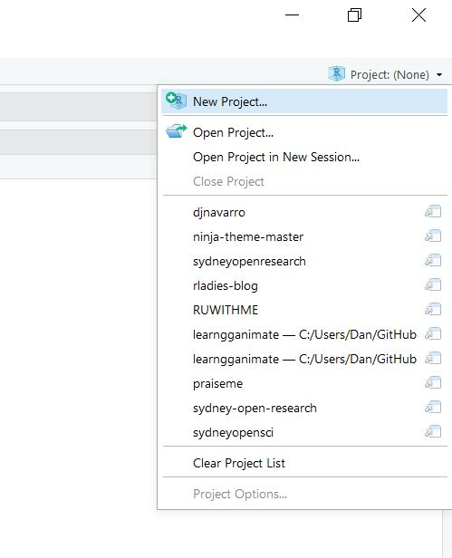
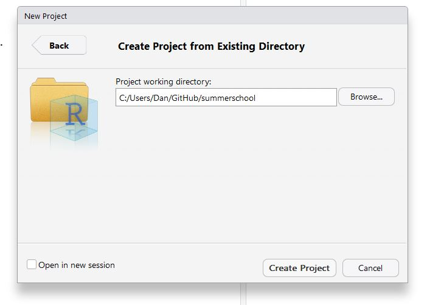
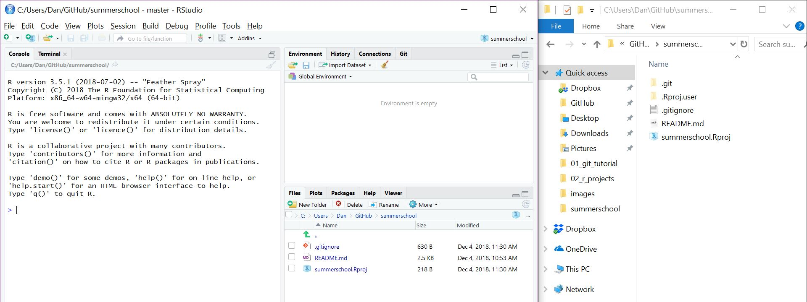
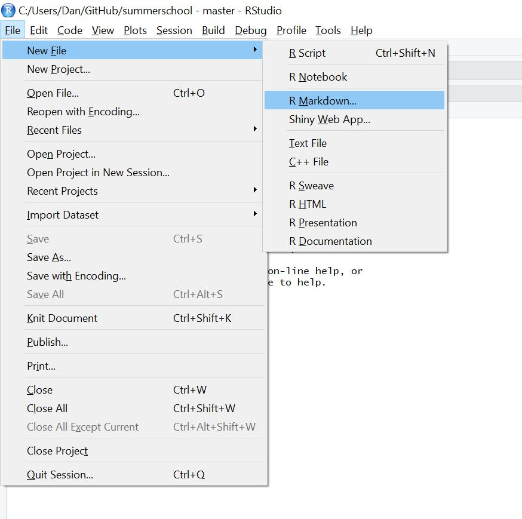
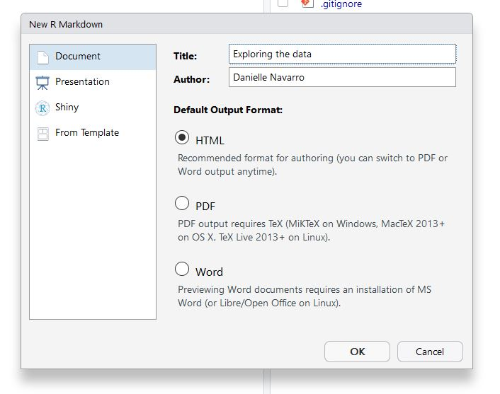
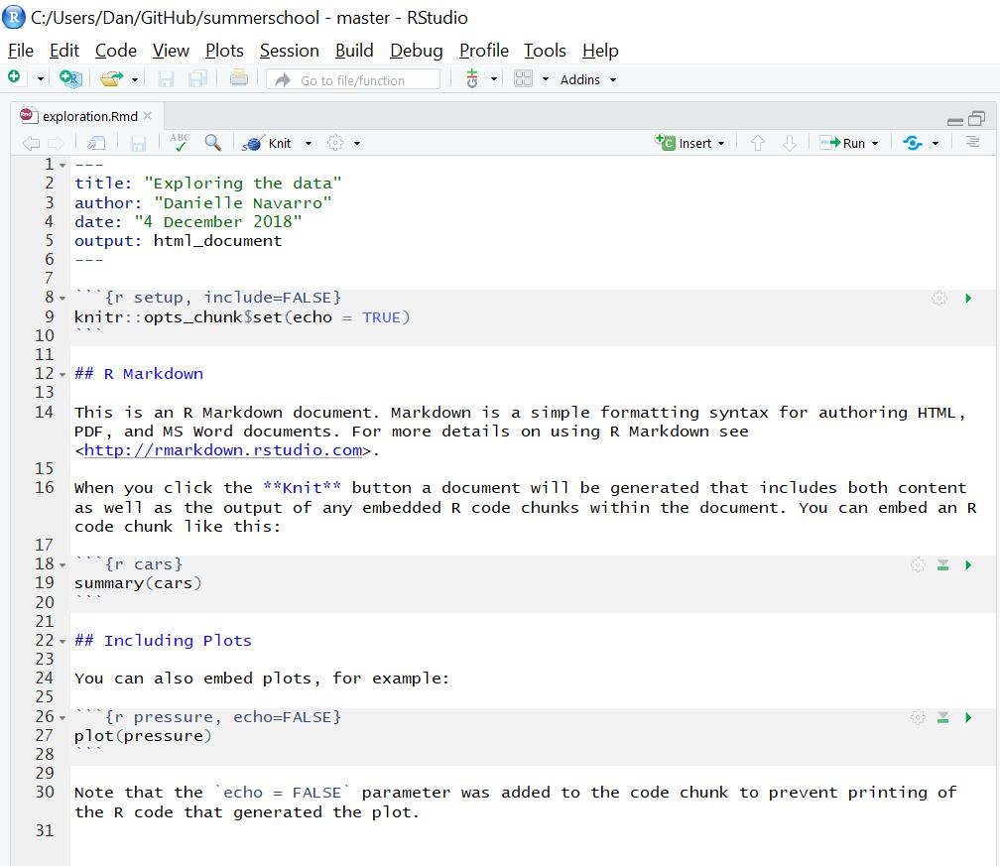

<h1 class="title toc-ignore display-3">
RStudio Projects & R Markdown
</h1>
================
Danielle Navarro
4 December 2018

<!--

  html_document:
    includes:
      in_header: header.html
    theme: flatly
    highlight: textmate
    css: mystyle.css

-->
RStudio projects
----------------

Why work in projects?

-   RStudio will help you keep things tidy
-   There are packages (e.g., the `here` package) that can detect the `.Rproj` file and you can specify file paths relative to the project root.

How to do it

-   Go to the top right corner in RStudio, click on the dropdown menu, and select "New Project".
-   Because we're going to work in the existing folder that we created for the git tutorial (`summerschool`) select "existing directory" and then browse for the correct location.
-   Once you create the project, you'll see a new file called `summerschool.Rproj`.

   

Any time you want to switch between projects, use the drop down menu. RStudio will automatically change the working directory, start a new R session for you, and open up whatever files you had open last time you wer using it.

Creating the structure for our project:
---------------------------------------

-   experiment (stuff from day 1)
-   analysis (today!!)
-   models (stuff from day 3)

The analysis folder we'll subdivide into two folders:

-   data
-   docs

In real life, the data that you'd start with in the data folder would be very messy and require some advanced data wrangling skills, but we're not there yet so let's jump forward in time and add a "tidy" data set.

The frames data
---------------

The frames data set comes from a simple experiment I ran a little while ago (it’s experiment two from this paper). What we were interested in was understanding how people use statistical information to guide inductive inferences. For example, suppose you observe a sample of “robins” that have “plaxium blood” (whatever that is). How likely is it that “sparrows” will possess plaxium blood? Or “cows”? Does it matter how many robins you have seen? Does it matter whether you specifically selected robins and they turned out to have plaxium blood (category sampling) as opposed to detecting animals with plaxium blood that then turned out to all be robins (property sampling)? In that paper we had a computational model of inductive reasoning that made specific predictions about how the sample size (number of robins) and sampling method (property or category) would inflence people’s judgments.

In this particular experiment we didn’t show people animals (though we have done those too!) we just showed them small “alien rocks” called “sodor spheres”, and asked people to make guesses about new rocks of different sizes: test\_loc values of 1 and 2 were very similar to the items they were shown during training, whereas value 7 was quite dissimilar. The number of training observations ranged from 2 (sample\_size = "small") to 12 (sample\_size = "large") and was varied within-subject. So everyone saw two observations, made some generalization judgments (response on a scale from 0 to 9), then saw more training observations and so on. Participants were randomly assigned to a "property" sampling condition or to a category sampling one. We also recorded age, gender, and assigned each person a unique id.

The variable key: - id: the participant id number - gender: male or female - age: numeric, in years - condition: (between subject). category sampling = people were told observations were selected on the basis of their category membership (e.g., because it's a small bird, or a small rock, or whatever) vs property sampling = people were told observations were selected because of a property they posses (e.g., it has plaxium blood, or a plaxium coating). - sample\_size: (within subject) small, medium, large - indicating how many observations they'd been shown at this point in the experiment - n\_obs: (within subject). same as "sample\_size", but it's the actual number (2, 6 or 12) - test\_item: (within subject). what stimulus are they now being shown? numeric: 1 to 7. this is ordinal (or really, quasi-interval) where items 1-2 are essentially identical to observations they'd seen before, and 3-7 become progressively less similar (e.g., bigger bird, bigger rock, whatever...) - response: (the outcome, within subject). the rating the person gave (0-9 scale) for "how likely is it that this new stimulus possesses the property (e.g., plaxium blood)?" where 0 = not at all, 9 = certain (or something like that) There's quite a bit going on in the data since it's a two within-subject and one between-subject manipulation

R Markdown documents
--------------------

Until now our code has been written in *scripts*, and our documentation has been written using *markdown*. Both are nice things to have - scripts are good for organising your R commands, and markdown is an efficient way to write commentaries and notes.

Wouldn't it be nice to have some way to do both of these things in a single document? Yes of course it would. Enter R Markdown!

To create an R Markdown document use the Rstudio file menu:

Then give your document a title (and choose output type, which we'll assume to be HTML).

This creates untitled R Markdown document in the source pane:

Save it to the `docs` folder, with the name `exploration.Rmd`. So now you have this:

Click on the `Knit` button to see what happens

### Structure of an R Markdown document

-   the bit at the top is the "yaml header" (ignore it for now)
-   anything shaded in grey (between the backticks) is a *code chunk* and is treated just like an R script
-   anything in white treated like Markdown.

Play around with this for a bit! Get a feel for how it works, then delete everything after line 10 (i.e., leave the header, and the first code chunk). Now we're ready to go!
